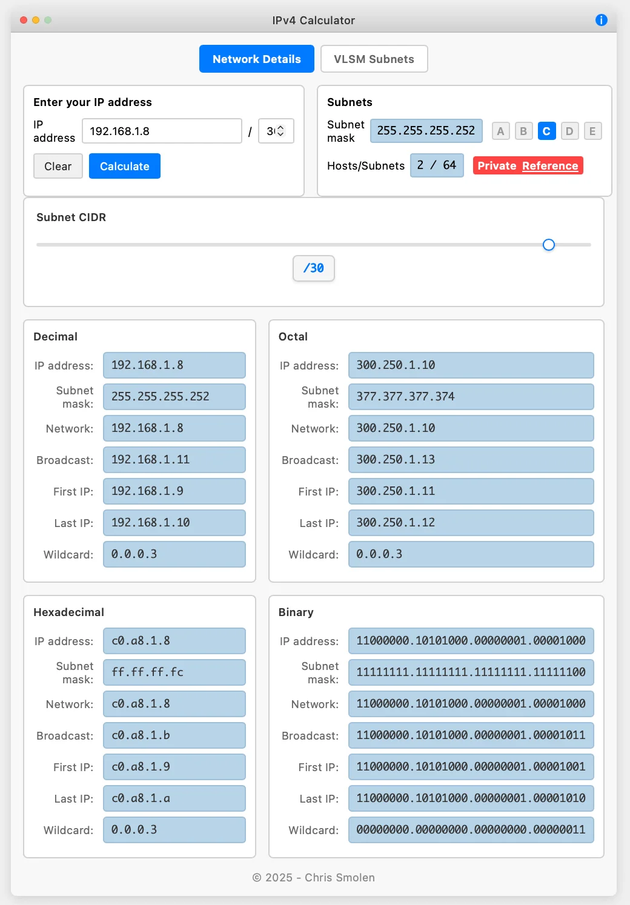

# IP Calculator v4

A modern, web-based IP subnet calculator with a Mac-inspired interface that provides comprehensive network information across multiple number formats.

## Features

### Multi-Format Display
- **Decimal** - Standard dotted decimal notation (192.168.1.0)
- **Octal** - Base-8 representation (300.250.1.0)
- **Hexadecimal** - Base-16 representation (c0.a8.1.0)
- **Binary** - Full binary representation with dot notation (11000000.10101000.00000001.00000000)

### Network Calculations
- **Network Address** - Calculated network base address
- **Broadcast Address** - Network broadcast address
- **First Usable IP** - First host address in the subnet
- **Last Usable IP** - Last host address in the subnet
- **Subnet Mask** - Network mask in all formats
- **Wildcard Mask** - Inverse subnet mask for ACLs

### Interactive Controls
- **CIDR Slider** - Visual subnet mask selection from /2 to /32
- **Manual Input** - Direct IP address and CIDR notation entry
- **Class Presets** - Quick buttons for Class A, B, and C networks
- **Real-time Updates** - Calculations update as you type or adjust sliders

### Network Analysis
- **Host Count** - Number of available host addresses
- **Subnet Count** - Total possible subnets for the given mask
- **Private/Public Detection** - Automatic identification of private IP ranges
- **Input Validation** - Ensures valid IP address format

### User Interface
- **Mac-Style Design** - Native macOS application appearance
- **Responsive Layout** - Clean, organized four-panel display
- **Keyboard Support** - Enter key triggers calculations
- **About Dialog** - Version and copyright information

## Usage

1. **Enter an IP Address** - Type any valid IPv4 address in the input field
2. **Set CIDR Notation** - Use the slider or manual input for subnet mask
3. **View Results** - All network information updates automatically across all formats
4. **Use Presets** - Click A, B, or C buttons for common network classes
5. **Clear and Reset** - Use the Clear button to start over

## Supported Network Classes

- **Class A**: 10.0.0.0/8 (Private)
- **Class B**: 172.16.0.0/16 (Private) 
- **Class C**: 192.168.1.0/24 (Private)

## Technical Details

- Pure HTML, CSS, and JavaScript implementation
- No external dependencies
- Client-side calculations only
- Works in all modern web browsers
- Responsive design for different screen sizes

## Version Information

- **Version**: 1.0
- **Release Date**: 2025
- **Author**: Chris Smolen
- **Repository**: [github.com/smolz/ip-calculator-v4](https://github.com/smolz/ip-calculator-v4)

## License

© 2025 Chris Smolen

## Browser Compatibility

- Chrome 80+
- Firefox 75+
- Safari 13+
- Edge 80+

---

*IP Calculator v4 - Making network calculations simple and visual*
