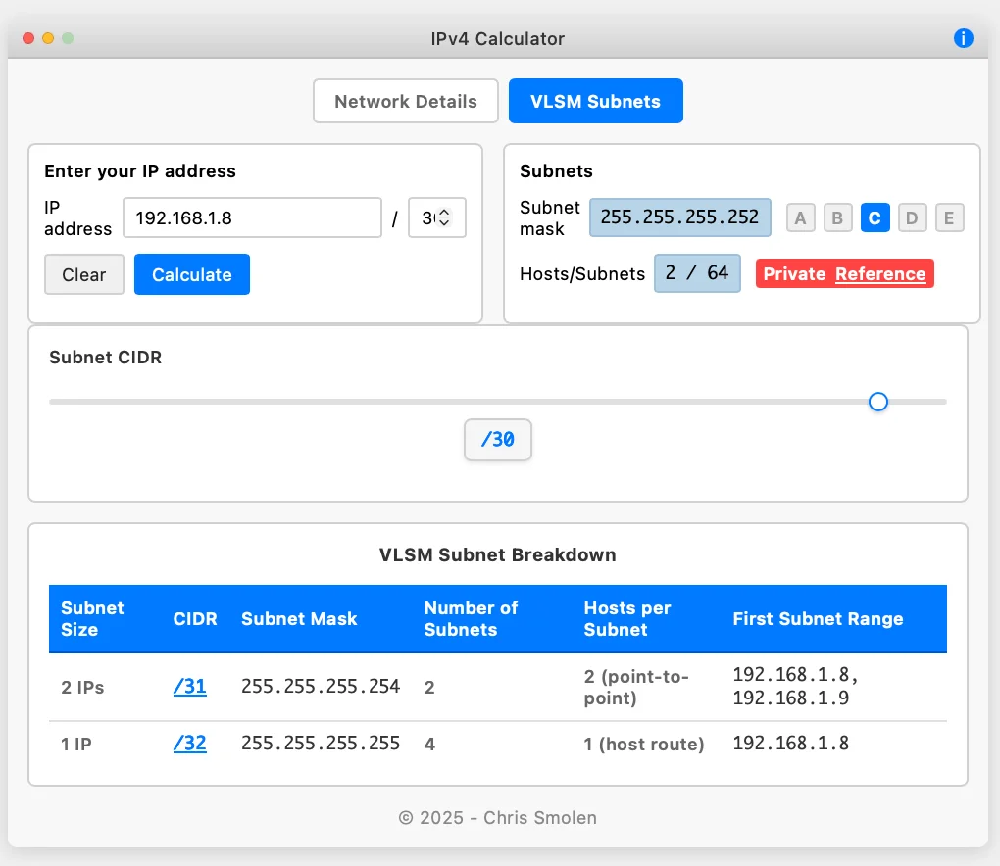

# IP Calculator v4

A modern, web-based IP subnet calculator with a Mac-inspired interface that provides comprehensive network information across multiple number formats.

## Screenshots

### Network Details View


### VLSM Subnets View


## Features

### VLSM Subnet Calculator (New in v2.0)
- **Visual Subnet Breakdown** - Interactive table showing all possible subnet divisions
- **Clickable CIDR Notation** - Click any /X value to see detailed subnet information
- **Full /30, /31, /32 Support** - Proper handling of special subnet types:
  - **/30 Subnets** - 4 IP addresses (2 usable hosts)
  - **/31 Point-to-Point** - RFC 3021 compliant, 2 usable IPs (no broadcast)
  - **/32 Host Routes** - Single host addresses
- **Detailed Subnet Views** - Network, broadcast, usable range for each subnet
- **Smart Labeling** - Appropriate terminology for each subnet type

### Multi-Format Display
- **Decimal** - Standard dotted decimal notation (192.168.1.0)
- **Octal** - Base-8 representation (300.250.1.0)
- **Hexadecimal** - Base-16 representation (c0.a8.1.0)
- **Binary** - Full binary representation with dot notation (11000000.10101000.00000001.00000000)

### Network Calculations
- **Network Address** - Calculated network base address
- **Broadcast Address** - Network broadcast address
- **First Usable IP** - First host address in the subnet
- **Last Usable IP** - Last host address in the subnet
- **Subnet Mask** - Network mask in all formats
- **Wildcard Mask** - Inverse subnet mask for ACLs

### Interactive Controls
- **CIDR Slider** - Visual subnet mask selection from /2 to /32
- **Manual Input** - Direct IP address and CIDR notation entry
- **Class Presets** - Quick buttons for Class A, B, and C networks
- **Real-time Updates** - Calculations update as you type or adjust sliders

### Network Analysis
- **Host Count** - Number of available host addresses
- **Subnet Count** - Total possible subnets for the given mask
- **Private/Public Detection** - Automatic identification of private IP ranges
- **Input Validation** - Ensures valid IP address format

### User Interface
- **Mac-Style Design** - Native macOS application appearance
- **Dual Mode Toggle** - Switch between Network Details and VLSM Subnets views
- **Responsive Layout** - Clean, organized four-panel display
- **Keyboard Support** - Enter key triggers calculations
- **About Dialog** - Version and copyright information

## Usage

1. **Enter an IP Address** - Type any valid IPv4 address in the input field
2. **Set CIDR Notation** - Use the slider or manual input for subnet mask (supports /2 to /32)
3. **Choose Your View**:
   - **Network Details** - See IP information in Decimal, Octal, Hex, and Binary formats
   - **VLSM Subnets** - View all possible subnet divisions and click any CIDR to see detailed breakdown
4. **View Results** - All network information updates automatically across all formats
5. **Explore Subnets** - In VLSM mode, click any /X notation to see all subnets at that level
6. **Clear and Reset** - Use the Clear button to start over

## Supported Network Classes

- **Class A**: 10.0.0.0/8 (Private)
- **Class B**: 172.16.0.0/16 (Private) 
- **Class C**: 192.168.1.0/24 (Private)

## Technical Details

- Pure HTML, CSS, and JavaScript implementation
- No external dependencies
- Client-side calculations only
- Works in all modern web browsers
- Responsive design for different screen sizes

## Version History

### Version 2.0 (2025)
- Added VLSM Subnet Calculator with interactive subnet breakdown
- Full support for /30, /31 (RFC 3021), and /32 subnets
- Dual-mode interface (Network Details / VLSM Subnets)
- Clickable CIDR notation for detailed subnet views
- Smart labeling for point-to-point and host route subnets

### Version 1.0 (2025)
- Initial release
- Multi-format display (Decimal, Octal, Hex, Binary)
- Network calculations and analysis
- Mac-style user interface
- Real-time updates and input validation

**Author**: Chris Smolen  
**Repository**: [github.com/smolz/ip-calculator-v4](https://github.com/smolz/ip-calculator-v4)

## License

© 2025 Chris Smolen

## Installation & Deployment

### Using the Web Version
Simply visit the hosted version at: [https://smolz.github.io/ip-calculator-v4/](https://smolz.github.io/ip-calculator-v4/)

### Add to Home Screen / Dock (PWA)
This app works as a Progressive Web App (PWA) and can be installed on your device:

**iOS Safari:**
1. Open the app in Safari
2. Tap the Share button (square with arrow)
3. Select "Add to Home Screen"
4. Confirm and the app will appear on your home screen

**macOS Safari:**
1. Open the app in Safari
2. Click File menu → "Add to Dock"
3. The app will appear in your dock as a standalone application

**Chrome/Edge (Desktop & Mobile):**
1. Look for the install icon in the address bar
2. Click "Install IP Calculator v4"
3. The app will install as a native-like application

### Deploy Your Own Copy

#### GitHub Pages (Recommended)
1. Fork or create a new repository on GitHub
2. Upload the `index.html` file to the repository root
3. Go to repository **Settings** → **Pages**
4. Select **"Deploy from a branch"** → **"main"** → **"/ (root)"**
5. Your app will be live at `https://yourusername.github.io/repository-name/`

#### Local Development
```bash
# Python 3
python3 -m http.server 8000

# Node.js (install http-server first)
npm install -g http-server
http-server

# PHP
php -S localhost:8000
```
Then visit `http://localhost:8000`

**Note:** PWA features require HTTPS or localhost - they won't work with `file://` URLs.

## Browser Compatibility

- Chrome 80+
- Firefox 75+
- Safari 13+
- Edge 80+

---

*IP Calculator v4 - Making network calculations simple and visual*
